# **TOPIC 01 - FUNDAMENTAL OF C PROGRAMMING LANGUAGE**

## **1. Introduction**

**C** is a general-purpose programming language created by **Dennis Ritchie** at  the Bell Laboratories in **1972**[^1].

It is a very popular language, despite being old. The main reason for its popularity is because it is a fundamental language in the field of computer science.

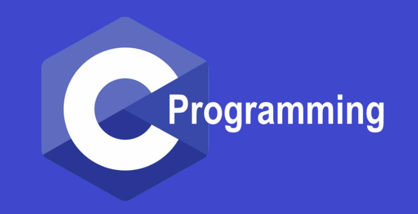

C is strongly associated with UNIX, as it was developed to write the [UNIX](https://en.wikipedia.org/wiki/Unix) operating system.

## **2. Development Environment**

In this section, we presenta a development enviroment for working with your C program. A development enviroment is a collection of procedures and tools for developing, testing and debugging an application or program.

In this course, we mainly focus on Cygwin[^2], a framework contains the number of tools which provide functionality similar to Linux distribution on Windows OS. To install Cygwin on your computer, first, you need download the setup file, which is available on the Cygwin homepage.

> Note: **You have to choose the right version of your system, either 32-bit or 64-bit.**

### **2.1 Install Cygwin and GCC**

After completely download the appropriate setup file, let's begin the installation process.

From **Figure 1** to **Figure 10** show the step-by-step guild to successfully install Cygwin and GCC enviroment on your system.

**Figure 1**: Welcome screen of Cygwin installation

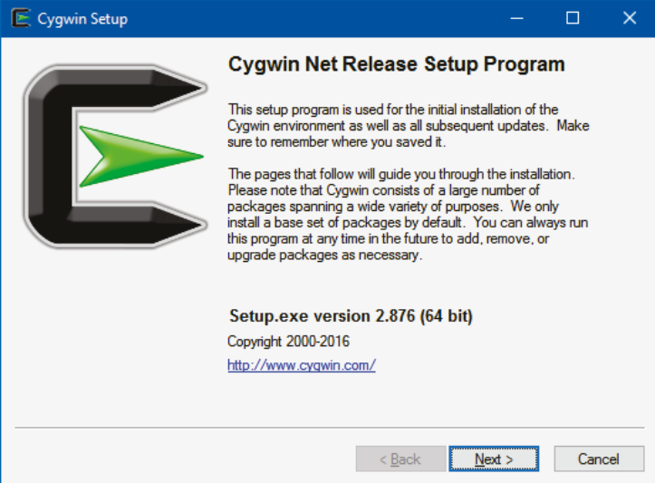

**Figure 2**: Choose the way to download the installation source

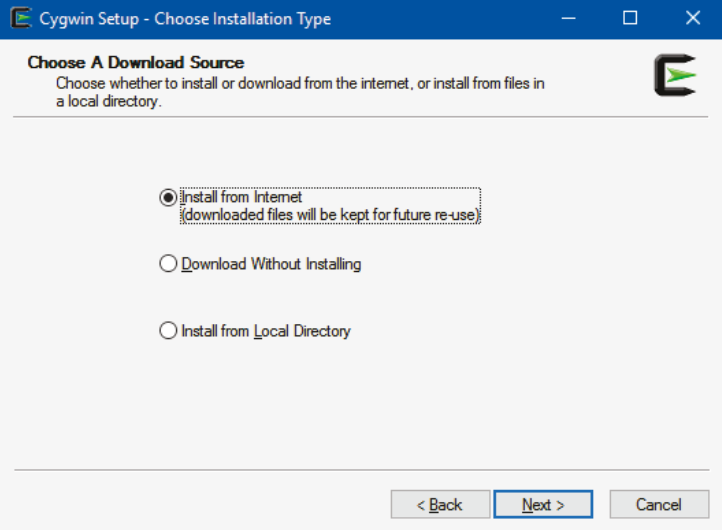

**Figure 3**: Select root install directory

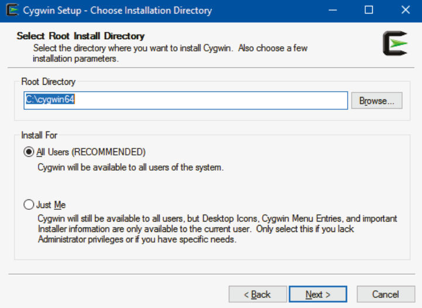

**Figure 4**: Select the directory of local package

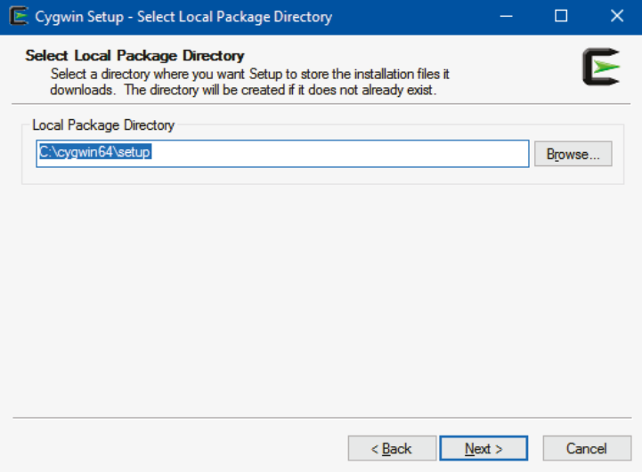

**Figure 5**: Select your internet connection

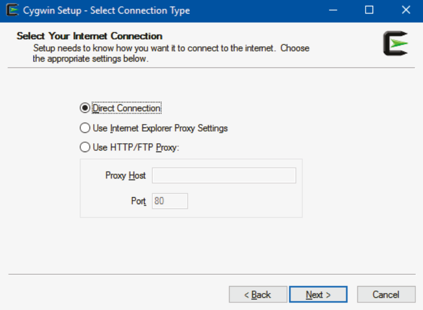

**Figure 6**: Select a download site

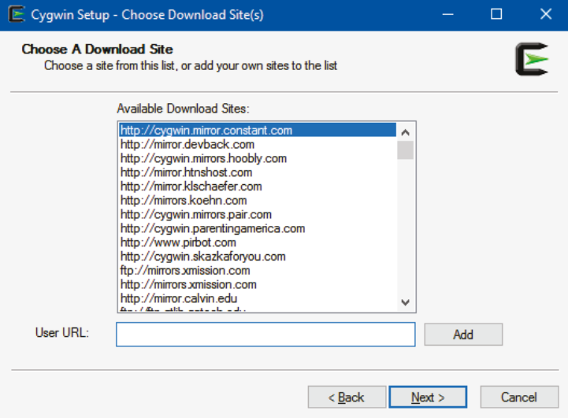

**Figure 7**: Select package
> Note: This is the most important step, you must select the following components to work with C/C++ environment on Cygwin, by clicking "*Skip*" marker:

- **gcc-core**: C compiler sub-package.
- **gcc-g++**: C++ sub-package.
- **libgcc1**: C runtime library.
- **gdb**: The GNU Debugger.
- **make**: The GNU version of the 'make' utility.
- **libmpfr4**: A library for multiple-precision floating-point arithmetic with exact rounding.

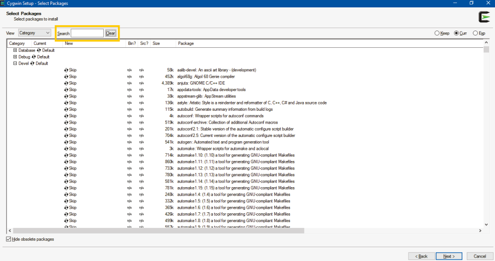

**Figure 8**: Resolving dependencies for setup process

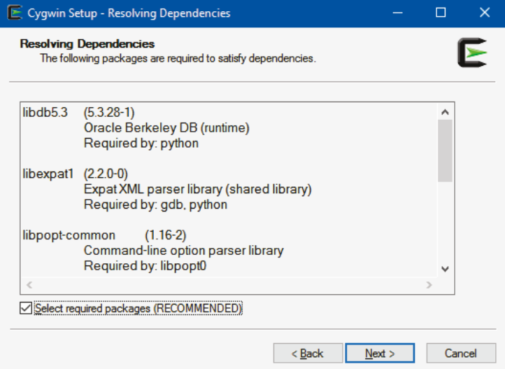

**Figure 9**: Installing Cygwin and components

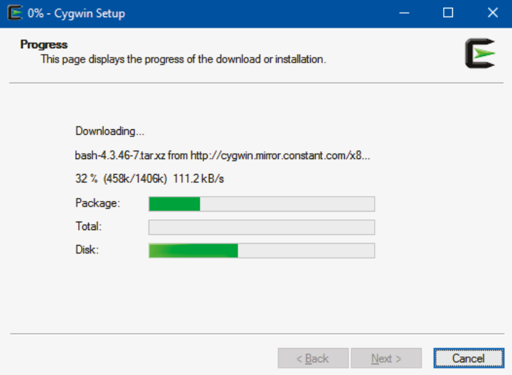

**Figure 10**: Installation complete screen

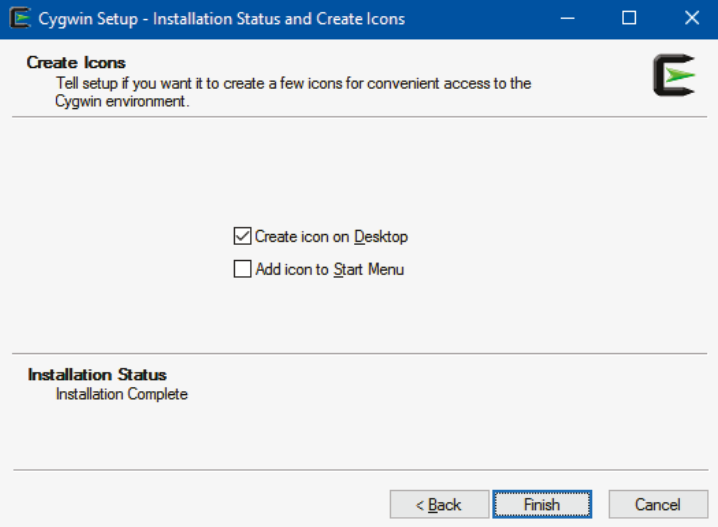

### **2.2 Add Cygwin to System Path**

After we have successfully all requirement components to work with C/C++ on Cygwin environment, but you can only call Cygwin commands in Cygwin Terminal. The question is, can call Cygwin commands in within either Windows CMD[^3] command-line or Windows PowerShell. Absoblutely, the answer is "Yes", we need few more steps to do this. First, you need to navigate to System Properties windows by following step-by-step:

With Windows 11:

- Right-click on "This PC" tab on File Explorer, after that we select "Properties".
- The Settings tab will be opened, we select "Advanced System Settings" which below Device Specifications section.
- We select "Environment Variables...". In System Variables section, we select "Path" -> select "New" -> type the path of Cygwin "bin" directory. (bin directory locate within root directory in **Figure 3**)

With Window 10: We can search "edit the system environment variables" and do step 3 similar to Windows 11.

## **3. C Programming Language**

Before we go deeper into C programming language, let's execute your first C program. We should create folder for learning C programming language, we create folder **Topic_01** and sub folder **codes** into **Topic_01** to store source code for this learning.

In this course, we use Text Editor application to write code which is Notepad++[^4]. Currently, there have many applications that support to write code, but it is divided into two names: Text Editor and Integrated Development Environment (IDE). *Why do I choose Text Editor instead of IDE?*

Because this is the fundamental course, so we need to learn some necessary programming knowledges such as how to install development enviroment, compile and run code by command lines. Besides, you can practice and memorize the syntaxes without recommendations, C programming language is the fundamental language, if you understand the basic knowledges of C programming language then you can learn other programming languages easily. Meanwhile, IDE is integrated many support tools such compiler, debugger, formater, etc. Almost IDE is development environment for professional programmer.

In **source_codes** folder, we create a new file with name file is first_program.c. In this file, you will paste below code into this file:

```C
// first_program.c
// A first program in C
#include<stdio.h>

// function main begins program execution
int main(){
    printf("Hello World!\n");
}
```

Although this program is simple, it contains several important features of the **C/C++** programming language. Lines **1**, **2**, and **5** begin with `//` symbol, indicates that these lines are comments. You should insert comments to your program for program readbility, and comments are ignored by the compiler. Another way to make comments to your program is using `/* ... */`, a multi-line comments.

Line **3** is a pre-processor directive, in this case, we tell the preprocessor to include the contents of the **standard input/output header** in the current program. Line **6**, the main function, is a part of every C/C++ program. The parentheses after main indicate that main is a program building block called a function. C/C++ programs contain one or more functions, on of which must be main. Every program in C/C++ begins executing at the function main. The keyword **int** before the **main** function indicates that this function returns an integer value.

In line **8**, we call a statement, printf, to instruct the computer performs an action, in this case, display the string of characters marked by the quotation marks on the screen. An important note is that every statement must end with a semicolon (;), as knowledge as the statement terminator. The last two characters in the argument of printf statement is called escape character. these characters will not be printed on the screen, below table shows some common escape characters.

| Escape sequence | Description                                                     |
| :--:            | :--                                                             |
| `\n`            | Newline. Position the cursor at the beginning of the next line. |
| `\t`            | Horizontal tab. Move the cursor to the next tab stop.           |
| `\a`            | Alert. Produces a sound or visible alert without changing the current cursor position |
| `\\`            | Backslash. Insert a backslash character in a string.            |
| `\"`            | Double quote. Insert a double-quote character in a string.      |

You had an overview of a program in C. Now, we focus on how to compile your document program to an executable program. We will compile the program by command line on CMD or Cygwin, when the command window shows up, the default directory is user directory, you type `cd` to change folder in CMD (**Figure 11**):

```shell
cd \d D:/Programming_Methodology/Topic_01/codes/
```

The syntax `cd` is used to current change directories, the flag `\d` means to change the current drive as well as the current directory for a drive, file first_program.c is placed into D drive and Programming_Methodolody/Topic_01/codes folder.

**Figure 11**: Change the current directory to directory containing file
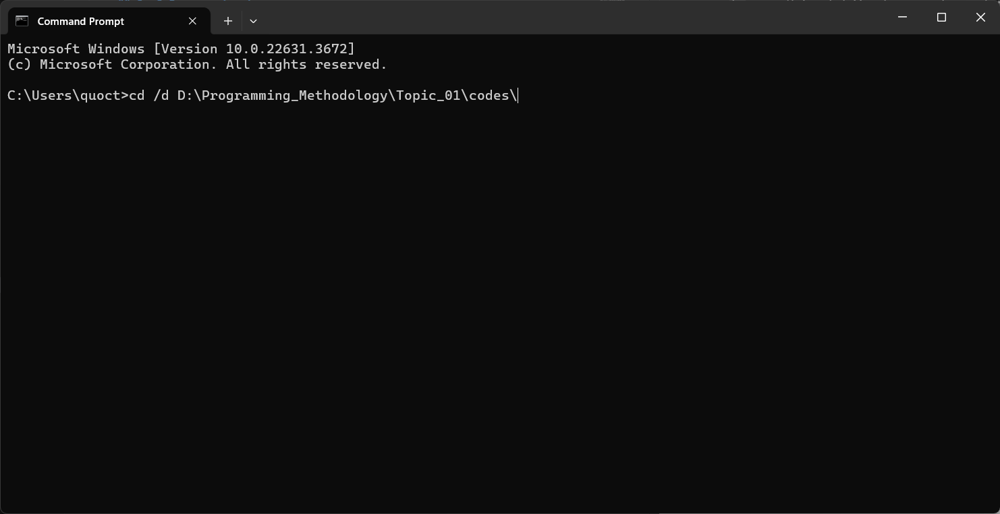

You are currently in the directory containing first_program.c file, type the command as follow `gcc first_program.c -o first_program.exe` or `g++ first_program.c -o first_program.exe`, and the GCC will compile your document program to an executable program (whole file extension is **.exe**) and place in the same window of your document program (**Figure 12**).

**Figure 12**: Compile your program
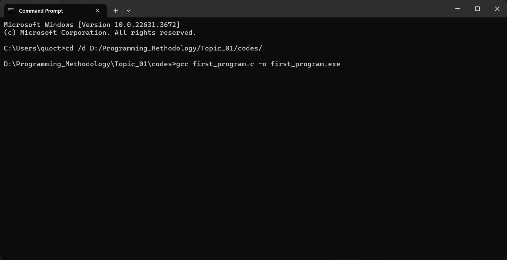

After compile from source code to an executable program, to run it, we easily call this program on the CMD window, as in **Figure 13**

**Figure 15**: Run your program
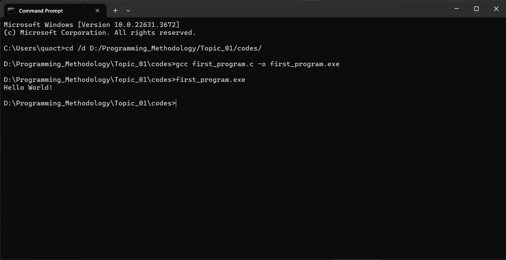

The rest of this section is organized as follows: (1) datatypes, (2) variables and constant, (3) arithmetic operators, and (4) control flow.

### **3.1 Datatypes**

The below table shows several fundamental datatypes of C, along with the sizes and the ranges of value instances of these types may have. We must note that bool type is not available in C environment, thus, in case you want to use it, you need include the **stdbool.h** header.

| *Value type* | *Byte* | *Range*                                                                     |
| :--:         | :--:   | :--:                                                                        |
| `int`        | 4      | 32-but signed two's complement integer ($-2^{31}$ to $2^{31}-1$, inclusive) |
| `char`       | 1      | 8-but signed two's complement integer ($-2^{7}$ to $2^{7}-1$, inclusive)    |
| `float`      | 4      | 32-but IEEE 754 single-precision float, $3.4E+/-38$ (7 digits)              |
| `double`     | 8      | 64-but IEEE 754 single-precision float, $1.7E+/-308$ (15 digits)            |
| `bool`       | 1      | `true` or `false`                                                           |

### **3.2 Variables and Constants**

In C, and like the most programming languages, is able to use named variables and their contents. Variables are simply names used to refer to some location in memory - a location that holds a value with which we are working. To declare a variable in C, it has to begin with the data type, then the variable name, the optional part is the assigned content for the variable. Variable names in C are made up of letters (upper and lower case) and digits. The underscore character ("_") is also permitted. Names must not begin with a digit and do not use any special prefix characters. Upper and lower case letters are distinct, so *x* and *X* to different names, and all upper case for symbolic constants.

```C
// Using variable
#include<stdio.h>

int main(){
    int age = 18;
    printf("Happy &d Birthday!\n", age);
    return 0;
}
```

The above program declares a variable, which is age, has `int` type and assigns its value is 18. Then, use `printf` statement to print the content of age on the screen, between the predefined sequence of characters. The `%d` character indicates the the compiler to replace its current position to the value of `age`. The below program will calculate the circumference of a circle by prompting user to input a radius, and then the circumference of corresponding circle.

```C
\\ curcle.c
#include<stdio.h>

int main(){
    const float PI = 3.14;
    int radius;
    float circumference;

    printf("Enter the radius: "); // prompt
    scanf("%d", &radius); // read an integer

    circumference = 2 * PI * radius

    printf("Circumference: %f\n", circumference);
    return 0;
}
```

The above program declares a constant variable `PI` (line 5) and two variables (line 6, 7), which are `radius` and `circumference`. To declare a constant variable, we have to begin with `const` keyword; from that point, it becomes a read-only variable, that means, you can't edit its value. Next, prompt the user to input radius of circle at line 9, and the get assign the input's value to `radius` variable (line 10). You should note that, since the radius is an integer number, we use `%d`. At line 12. we calculate the circumference of the current circle on the right of "-" symbol, then assign its value to the left variable, which is `circumference`. Finally, print the result on the screen, but `circumference` is float number, we use `%f` in indicate the computer to print a floating-point number at corresponding position.

### **3.3 Arithmetic operators**

To calculate the result of an arithmetic expression, C provides some basic arithmetic operators. The arithmetic operators are binary operators, that means, the operator + has to have two operandsm for example "3+7".

| *Arithmetic operator* | *Operator*     | *Algebraic expression*          | *C expression* |
| :--:                  | :--:           | :--:                            | :--:           |
| `+`                   | Addition       | $x + 7$                         | `x + 7`        |
| `-`                   | Subtraction    | $y - z$                         | `y + z`        |
| `*`                   | Multiplication | $a x b$                         | `a * b`        |
| `/`                   | Division       | $x/y$ or $\frac{x}{y}$ or $x÷y$ | `x / y`        |
| `%`                   | Remainder      | r mod s                         | `r % s`        |

### **3.4 Control flow**

The control-flow of a language specify the order in which computations are performed. In the above sample programs, we have many declarations and statements, which ended by a semicolun. To group those into a block, we use braces "{" and "}", thus they are syntactically equivalent to a single statement. And there is no semicolon after the right brace that ends a block. The if-else statement is used to express decisions, whose syntax is:

```C
if(true-false-expression){
    // Statement1
}
else{
    // Statement2
}
```

The `true-false-expression` is evaluated; if it is `true`, `Statement1` is executed, if it is `false`, `Statement2` is executed instead. Conditions in if statements are formed by using the equality operators and relational operators summarized in below table. The relational operators all have the same level of precedence and the associate left to right. The equality operators have a lower level of precedence than the relational operators and they also associate left to right.

| *Algebraic operator* | *C operator* | *Example* | *Meaning*                       |
| :--:                 | :--:         | :--:      | :--:                            |
| Equality operators   |              |           |                                 |
| $=$                  | `==`         | `x == y`  | x is equal to y                 |
| $\neq$               | `==`         | `x == y`  | x is not equal to y             |
| Relational operators |              |           |                                 |
| $>$                  | `>`          | `x > y`   | x is greater than y             |
| $<$                  | `<`          | `x < y`   | x is less than y                |
| $\ge$                | `>=`         | `x >= y`  | x is greater than or equal to y |
| $\le$                | `<=`         | `x <= y`  | x is less than or equal to y    |

### **Else-If Statement**

In Section 3, 4, we introduce the control statement "if - else", which evaluates one condition at a time, in order to sequentially evaluate the conditions, we use "else - if" statement, as follows:

```C
if(expression1){
    // Statement1
}
else if(expression2){
    // Statement2
}
else if(expression3){
    // Statement3
}
else{
    // Statement4
}
```

By using this structure, the expressions are evaluated in order, if an expression is true, the statement associated with it is executed, and this terminates the whole chain. The last else part handles the "none of the above" or default case, that means, if none of the other conditions is satisfied, the default statement is executed. For example, see the below program.

```C
// conditional-statements.c
#include<stdio.h>

int main(){
    float score = 8.4;

    if(score < 5>){
        printf("You need to improve your score!");
    }
    else if(score < 8){
        printf("That's OK!");
    }
    else if(score < 9){
        printf("Good!");
    }
    else{
        printf("Excellent!");
    }
}
```

## **4. Exercise**

1. Write a C program to print your name, date of birth, and mobile number
2. Write a C program prompting user to input two integer numbers, then compute and print the results of addition, subtraction, multiplication, division, and remainder.
3. Write a C program to compute the perimeter and area of a rectangle with a height provided by user
4. Write a C program to convert specified days into years, weeks and days. (Note: ignore leap year)
5. Write a C program to convert the temperature from Celsius to Fahrenheit.
6. Write a C program to return an absolute value of a number.
7. Write a C program to check wether a year is a leap year or not.
8. Write a C program to find maximum between two numbers.
9. Write a C program to find maximum between three numbers.
10. Write a C program to check whether a number is even or odd.
11. Write a C program to input a character and check whether it is alphanumeric or not.
12. Write a C program to input angles of a triangle and check whether triangle is valid or not.
13. Write a C program to input marks of five subjects Physics, Chemistry, Biology, Mathematics and Computer. Calculate percentage and grade according to following: \
    Percentage > 90%: Grade A \
    Percentage > 80%: Grade B \
    Percentage > 70%: Grade C \
    Percentage > 60%: Grade D \
    Percentage > 40%: Grade E \
    Percentage < 40%: Grade F

----
[^1]: Wikipedia, "C (programming language)", 17 May 2024. [Online]. Available: [Here](https://en.wikipedia.org/wiki/C_(programming_language)) [Accessed 21 May 2021]
[^2]: [Cygwin](https://www.cygwin.com/)
[^3]: [CMD.exe](https://en.wikipedia.org/wiki/Cmd.exe)
[^4]: [Notepad++](https://notepad-plus-plus.org/downloads/)
