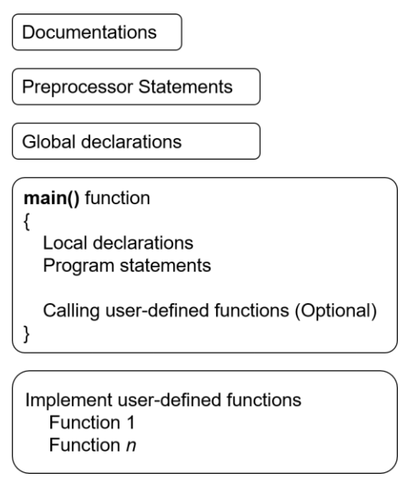

# **TOPIC 03 - FUNCTION AND PROGRAM STRUCTURES**

## **1. Introduction**

In previous [topic](../Topic_02/) we studied about switch-case condition and and loop structures. We will remember some learned structures:

* `if-else`, `else if` and `switch-case` strutures:

```C
// if-else and else if structure
if(expression){
    //statements
}
else if(expression){
    //statements
}
else{
    //statements
}

// switch-case structure
switch(expression){
    case const-expre-1: statements
    case const-expre-2: statements
    case const-expre-3: statements
}
```

* `while`, `for` and `do-while` structures:

```C
// while loop
while(condition-to-stop){
    // codes 
}

// for loop
for(beginning-index; condition-to-stop; update-condition){
    // codes
}

// do-while
do{
    //codes
}
while(condition-to-stop);
```

In this topic, we focus on function and program structures.

## **2. Function and Program Structures**

Functions break large computing tasks into smaller ones, and enable people to build on what others have done instead of starting over from scratch. Appropriate functions hide details of operations from parts of the program that don't need to know about them, thus clarifying the whole, and easing the pain of making changes.

> Other programming language may distinguish between a "function", "subroutine", "subprogram", "proceduce", or "method"

C has been designed to make functions efficient and easy to use; C programs generally consist of many small functions rather than a few big ones. A program may reside in one or more source files. Source files may be compiled separately and loaded together, along with previously compiled functions from libraries. We will not go into that process here, however, since the details vary from system to system.

A function is often executed (called) several times, from several different places, during a single execution of the program. After finishing a subroutine, the program will branch back (return) to the point after the call.

As a basic example, suppose you are writing code to print out the first 5 squares of numbers, do some intermidiate processing, the print the first 5 squares again. We could write it like this:

```C
// function1.c
#include<stdio.h>

int main(){
    int i;
    
    // First time
    for(i = 1; i <= 5; i++){
        printf("%d\n", i*i);
    }

    // Second time
    for(i = 1; i <= 5; i++){
        printf("%d\n", i*i);
    }
    return 0;
}
```

In above program, we can easily see that there is a duplicate of the same procedure (in line **8** and **14**). Thus, we may want to somehove put this code in a separate place and simply jump to this code when we want to use it.

```C
// function2.c
#include<stdio.h>

void printSquare();

int main(){
    
    printSquare();
    printSquare();

    return 0;
}

void printSquare(){
    int i;
    
    for(i = 1; i <= 5; i++){
        printf("%d\n", i*i);
    }
}
```

A function is like a black box. It takes in input, does something with it, then spits out an answer. Note that a function may not take any inputs at all, or it may not return anything at all. In the above example, if we were to make a function that loop, we may not need any inputs, and we aren't returning anything at all (Text output doesn't count - when we speak of returning we mean to say meaning data that the program can use).

We have some terminology to refer to functions:

* A function, call it *f*, that uses another function *g*, is said to call *g*. For example, *f* calls *g* to print the squares of ten numbers.
* A function's inputs are known as its **arguments**.
* A function *g* that gives some kind of answer back to *f* is said to **return** that answer. For example, *g* returns the sum of its arguments.

In runtime, or execution time, when the program pointer references to **return** statement of function, it will exit the current program, that means, the statements behind that **return** will not be executed.

### **2.1 Writing function in C**

In generalm if we can to declare a function, its format is as follows:

```C
return-type function-name(type1 arg1, type2 arg2, ...){
    declarations and statements
    return syayement
}
```

We've previously said that a function can take no arguments, or can return nothing, or both. To do this, we use C's `void` keyword in above program. Let's see the following example, a function takes one parameter and returns an integer number.

```C
// function3.c
#include<stdio.h>

// Global declaration
void isEven(int);

int main(){
    int number;
    
    printf("Input number = ");
    scanf("%d", &number);

    printf("%d", isEven(number));

    return 0;
}

// Function definition
void isEven(int n){
    if(n%2 == 0)
        return 1;
    return 0;
}
```

In the above example, we declare a function, named `isEven`, which check whether a number is even or not. In line **5**, we define a function signature[^1] is `isEven`, without the implementation. Then in line **19**, we implement the `isEven` function. The function receives one input and return (1, 0), which 1 indicates the input number is evenm and vice versa.

### **2.2 Program structure**

In C, your program is controlled within main function, and all source code in main is called the body of the main function. The `main` function can be preceded by documentation, preprocessor statements and global declarations. The following figure shows the basic structure of C program.



To illustrate each part in above figure, let's see the below program.

```C
// Filename: function-sample.c

// Preprocessor statements
#include<stdio.c>
#include<math.h>
#define PI 3.14159

// Global decleration
double getArea(double);

int main(){
    double radius;

    do{
        printf("Radius = ");
        scanf("%lf", &radius);
    }while(radius < 0);

    printf("Area = %lf", getArea(radius));

    return 0;
}

// Function definition
double getArea(double r){
    if(r < 0)
        return -1;
    return 2.0 * PI * pow(r, 2);
}
```

In line 6 of the above program, we define a macro, named PI, to hold the value of $\pi$. Object-like macros were conventionally used as part of good programming practice to create symbolic names for constants, instead of hard-coding the numbers throughout the code. An alternative in both C and C++, especially in situations in which a pointer to the number is required, is to apply the const qualifier to a global variable. This causes the value to be stored in memory, instead of being substituted by the preprocessor. In line 31, in order to compute x to the power
of y, we include the pre-defined `math.h` library.

## **3. Exercises**

1. Write a C function to print sum of all even numbers between 1 to *n*. Validating the input, in case the input isn't correct, prompt user to enter it again.
2. Write a C function to print sum of odd even numbers between 1 to *n*. Validating the input, in case the input isn't correct, prompt user to enter it again.
3. Write a C function to print table of any number.
4. Write a C function to enter any number and calculate sum of all natural numbers between 1 to *n*. Validating the input, in case the input isn't correct, prompt user to enter it again.
5. Write a C function to find first and last digits of any number.
6. Write a C function to calculate sum of digits of any number.
7. Write a C function to calculate product of digits of any number.
8. Write a C function to count number of digits in any number.
9. Write a C function to swap first and last digits of any number.
10. Write a C function to print an input number in reverse order.
11. Write a C function to enter any number and check whether the number is palindrome or not.
12. Write a C function to check whether a number is Prime number or not. Validating the input, in case the input isn't correct, prompt user to enter it again.
13. Write a C function to check whether a number is Armstrong number or not.
14. Write a C function to check whether a number is Perfect number or not.
15. Write a C function to print all Prime numbers between 1 to *n*. Validating the input, in case the input isn't correct, prompt user to enter it again.
16. Write a C function to print all Armstrong numbers between 1 to *n*. Validating the input, in case the input isn't correct, prompt user to enter it again.
17. Write a C function to print all Perfect numbers between 1 to *n*. Validating the input, in case the input isn't correct, prompt user to enter it again.
18. Write a C function to convert Decimal to Binary number system.
19. Write a C function to compute the Factorial of *n*. Validating the input, in case the input isn't correct, prompt user to enter it again.
$$n! = 1 * 2 * 3 * \cdots * n \quad (n \geq 0)$$

[^1]: MDN contributors, "Signature (functions)", 8 Jun 2023. [Online]. Availabel: [Signature (functions)](https://developer.mozilla.org/en-US/docs/Glossary/Signature/Function) [Accessed 31 May 2021]
