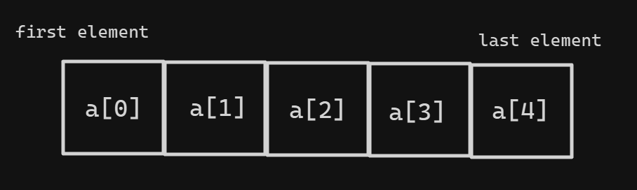
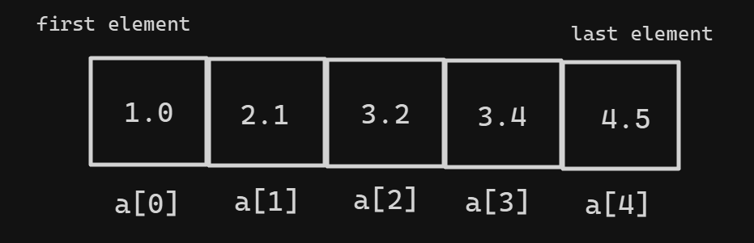
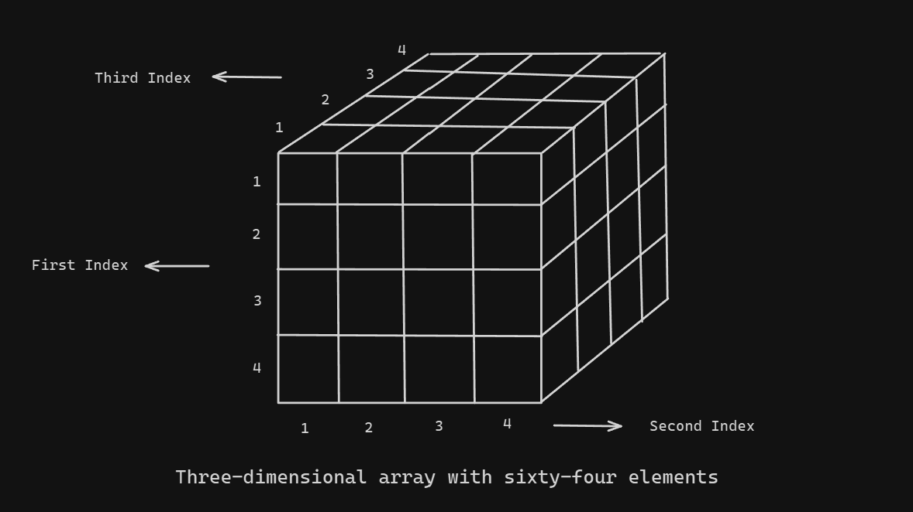
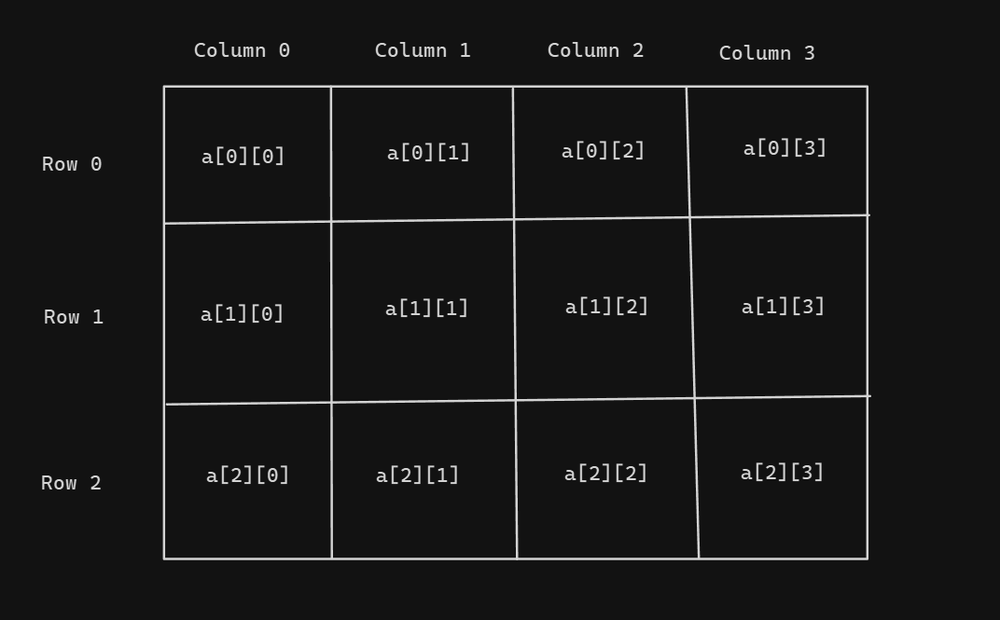
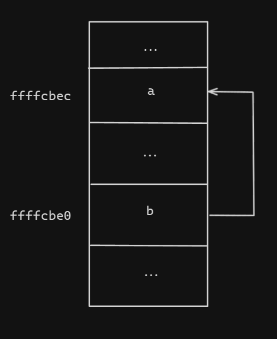
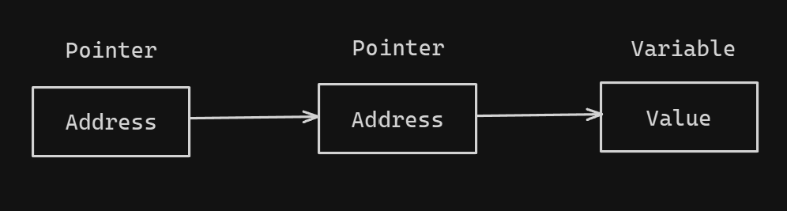

# **TOPIC 04 - POINTER AND ARRAY (1D and 2D)**

## **1. Introduction**

In previous [topic](../asset/image/Topic_03/), we studied about function and program structure. There is short reviewing about previous topic.

**Function structure**: Functions break large computing tasks into smaller ones, and enable people to build on what others have done instead of starting over from scratch. Appropriate functions hide details of operations from parts of the program that don't need to know about them, thus clarifying the whole, and easing the pain of making changes.

```C
return-type function-name(type1 arg1, type2 arg2, ...){
    declarations and statements
    return syayement
}
```

We've previously said that a function can take no arguments, or can return nothing, or both. To do this, we use C's `void` keyword in above program.

**Program structure**: In C, your program is controlled within main function, and all source code in main is called the body of the main function. The `main` function can be preceded by documentation, preprocessor statements and global declarations.

In this topic, we will study about Array (1D and 2D) and fundamental of pointers.

## **2. Array**

Arrays are data structures consisting of related data items ò the same type, in a fixed-size sequential collecttion of elements. Instead of declaring individual variables, you can declare an array variable and access each specific element by an index. An arrat is a group of contigous memory locations; the lowest address corresponds to the first element and the highest address to the last element.



In above **figure**, we illustrate the structure of an array, which contains 5 elements and the first element has index at 0, and the last is 4. To declare an array in C program, you need to specify the data type of elements and the number of elements required by an array.

```C
type arrayName[size]
```

This is called a single-dimensional array. The `arraySize` must be an integer constant greater than zero and `type` can be any valid C data type. For example, to declare a 5-element array called balance of type double, use this statement:

```C
double balance[5];
```

### **2.1 Initialize Array**

You can initialize an array in C either one by one using a single statement, the number of values between braces `{}` cannot be larger than the number of elements that we declare for the array between square brackets `[]`.

```C
double balance[5] = {1.0, 2.1, 3.2, 4.3, 5.4};
```

If you omit the size of the array, an array just big enough to hold the initialization is created, as follows:

```C
double balance[] = {1.0, 2.1, 3.2, 4.3, 5.4};
```

Before we go futhure in assigning value to elements of an array, let's illustrate the structure of an example array above, as in below **figure**. All arrays have 0 as index of their first element which is also called the base index and the last index of an array will be toal size of the array mius 1.



Now, if we want to change the value of a specific element, for example, the $3^{rd}$ element, we use the following statement:

```C
balance[3] = 4.5;
```

### **2.2 Accessing Array Elements**

An element is accessed by indexing the array name. This is done by placing the index of the element within square brackets after the name of the array. For example:

```C
double b = balance[2];
```

The above statement get the value of balance array at $2^{nd}$ position, the assign it to a variable types `double`, called b.

Because each element of array is stored contigously, we usually use loop structures to access elements of an an array. Let's see the following program:

```C
// array1.c
#include<stdio.h>

int main(){
    int a[10];
    int i = 0;

    // Initialize value to elements of array
    for(i = 0; i < 10; i++){
        a[i] = i + 1;
    }

    // Output all element of array
    for(i = 0; i < 10; i++){
        printf("%d\t", a[i]);
    }

    return 0;
}
```

### **2.3 Multidimensional Array**

C programming language supports in declaring multidimensional arrays. The form of declaration is as follows:

```C
type arrayName[size1][size2][size3]...[sizeN];
```

For example, to declare a three-dimensional integer array, you write:

```C
int array[4][4][4];
```

And the size of multidimensional array can be calculated by multiplying all size of it, thus the example array has 64 elements. The below **figure** can illustrate this 3d-array, and each small box holds a value:



### **2.4 Two-dimension Array**

The simplest form of multidimensional array is the two-dimensional array. A two-dimensional array is a list of one-dimensional arrays, or we can consider as a matrix. To declare a two-dimensional integer array of size `[x][y]`, we would write as follows:

```C
type arrayName[x][y];
```

Where type can be any valid C data type and `arrayName` will be a valid C identifier. A two-dimensional array can be considered as a table which will have x number of rows and y number of columns. A two-dimensional array, which contains three rows and four columns can be shown as below **figure**:



Because the one dimensional of a 2-d array is another array, thus to initialize the values of 2-d array, we can write:

```C
int arr[2][3] = {{1, 2, 3}, {4, 5, 6}};
```

And to access an element in 2-d array, we need to specify the index of row and column, for example, to get value of element at first row and second column, we write:

```C
int value = arr[0][1];
```

Let's see the following program, which declares a 2-d array, then initializes values and print them on screen.

```C
// array2.c
#include<stdio.h>

int main(){
    int a[2][3];
    int i, j;

    // Initialize value to elements of array
    for(i = 0; i < 2; i++){
        for(j = 0; j < 3; j++){
            a[i][j] = i + j;
        }
    }

    // Output all element of array
    for(i = 0; i < 2; i++){
        for(j = 0; j < 3; j++){
            printf("%d\t", a[i][j]);
        }
        printf("\n");
    }

    return 0;
}
```

## **3. Pointers**

Every variable is a memory location and every memory location has its address defined which can be accessed using ampersand (`&`) operator, which denotes an address in memory. The following program will declare two variables, then print the memory's address.

```C
// pointers1.c
#include<stdio.h>

int main(){
    int a[10];
    int b;

    printf("Address of a[10] is %x\n", &a);
    printf("Address of b is %x\n", &b);

    return 0;
}
```

When executing the above program, the output can be `ffffcbc0` for `a[10]` and `ffffcbbc` for `b`.

A pointer is a variable whose value is the address of another variable, i.e., direct address of the memory location. Like any variable or constant, you must declare a pointer before using it to store any variable address. The general form of a pointer variable declaration is as follows, where **type** is a pointer's base type; it must be a valid C data type and **varName** is the name of the pointer variable.

```C
type *varName;
```

### **3.1 Using Pointers**

There are a few important operations, which we will do with the help of pointers very frequently. First, we define a pointer variable; second assign the address of a variable to a pointer; and finally, access the value at the address availabel in the pointer variable. This is done by using unary operator `*` the returns the value of the variable located at the address specified by its operand.

```C
// pointers2.c
#include<stdio.h>

int main(){
    int a = 10; // actual variable delaration
    int *b;     // pointer variable delaration

    b = &a;     // store address of 'a' in pointer variable

    printf("Address of a is %x\n", &a);
    printf("Address of b is %x\n", &b);
    printf("Address stored in b is %x\n", b);

    printf("Value of a is %d\n", a);
    printf("Value of b is %d\n", *b);

    return 0;
}
```

In the above program, we define an actual variable, called a, and a pointer, called b. Then, in line **8**, we assign the memory's address of a to b. Now, we can easily see that, a and b must have different address, but the value of them are same. When executing the program, we can have the output like this:

```shell
Address of a is ffffcbec
Address of b is ffffcbe0
Address stored in b is ffffcbec
Value of a is 10
Value of b is 10
```

The following **figure** can illustrate how the pointer, in above program, works in the main memory.



From above **figure**, it implies that when the value of a changed, it will also affect the value of b. However, in the other case, if we change the value of b, whether it affects the value of a. The answer is yes. Look back the pointers2.c program, now we insert few lines:

```C
// pointers2.c
#include<stdio.h>

int main(){
    int a = 10;  // actual variable delaration
    int *b;      // pointer variable delaration

    b = &a;      // store address of 'a' in pointer variable

    printf("Address of a is %x\n", &a);
    printf("Address of b is %x\n", &b);
    printf("Address stored in b is %x\n", b);

    printf("Value of a is %d\n", a);
    printf("Value of b is %d\n", *b);

    *b = *b + 1; // change the value of 'b'

    printf("Value of a is %d\n", a);
    printf("Value of b is %d\n", *b);

    return 0;
}
```

Executing the program and we have:

```shell
Address of a is ffffcbec
Address of b is ffffcbe0
Address stored in b is ffffcbec
Value of a is 10
Value of b is 10
Value of a is 11
Value of b is 11
```

### **3.2 Pointers vs. Arrays**

Pointers and arrays are strongly related. In face, pointers and arrays are interchangcable in many cases. For example, a pointer that pointers to the beginning of an array can access that array by using either pointer arithmetic or array-style indexing.

```C
// pointers3.c
#include<stdio.h>

int main(){
    int arr[3] = {10, 200, 300};
    int *ptr;         // pointer variable delaration
    int i = 0;

    ptr = arr;        // ptr points to 'arr'

    for(i = 0; i < 3; i++){
        printf("Address of arr[%d] is %x\n", i, ptr);
        printf("Value of arr[%d] is %d\n", i, *ptr);

        // Move ptr to the next location
        ptr++;
    }

    return 0;
}
```

In above program, we declare an integer pointer, called `ptr`, which points to the first position of integer array, called `arr`. Then, in line **16**, we can use `ptr` to traverse elements in `arr`. Let's execute the program:

```shell
Address of arr[0] is ffffcbd0
Values of arr[0] is 10
Address of arr[1] is ffffcbd4
Values of arr[1] is 200
Address of arr[2] is ffffcbd8
Values of arr[2] is 300
```

### **3.3 Pointer to Pointer**

A ***pointer to a pointer*** is a form of multiple indirection, or chain of pointers. Normally, a pointer contains the address of avariable. When we define a pointer to a pointer, the first pointer contains the address of the second pointer, which points to the location that contains the actual value as shown below.



A variable that is a pointer to a pointer must be declared by placing an additional asterisk in front of its name. When a target value is indirectly pointed to by pointer to a pointer, accessing that value requires that the asterisk operator be applied twice.

```C
// pointers3.c
#include<stdio.h>

int main(){
    int val = 10;
    int *ptr1;         // pointer variable delaration
    int **ptr2;

    ptr1 = &val;       // ptr1 stores the address of 'val'
    ptr2 = &ptr1;      // ptr2 stores the address of 'ptr1'

    printf("Address of val is %x\n", &val);
    printf("Address stored in ptr1 is %x\n", ptr1);
    printf("Address of ptr1 is %x\n", &ptr1);
    printf("Address stored in ptr2 is %x\n", ptr2);

    printf("Value of val through ptr1 is %d\n", *ptr1);
    printf("Value of val through ptr2 is %d\n", **ptr2);

    return 0;
}
```

Executing the above program and we have:

```C
Address of val is ffffcbe4
Address stored in ptr1 is ffffcbe4
Address of ptr1 is ffffcbd8
Address stored in ptr2 is ffffcbd8
Value of val through ptr1 is 10
Value of val through ptr2 is 10
```

## **4. Case Study**

### **4.1 Automatically determining the size of array**

Let's consider the situation; supposing you declare an array with fixed size, then you define many loop structures to traverse the array. Now, you change the size of the array, that means, you must change the length of array in all your defined loop structures.

To overcome this problem, we need to automatically determine the size of array, and C supports us to do this, by using a small trick of the data-type size. In line **8** in of the following program, to determine the size of array, we use the `sizeof` statement, which returns the size of variable in byte. Fore example, `sizeof(arr)` is 16 byte, because `arr` contains 4 value of type array.

```C
// array3.c
#include<stdio.h>

int main(){
    int arr[] = {1, 20, 300, 4000};
    int i = 0;

    for(i = 0; i < sizeof(arr)/sizeof(arr[0]); i++){
        printf("arr[%d] = %d", i, arr[i]);
    }

    return 0;
}

```

### **4.2 Dynamic array**

This time, consider the situation that you defined a fixed size of an array, supposed 10 elements, then you want to add element at $11^{th}$. In this case, you think to declare a new array contains 11 elements to solve the problem. And again, you want to add the $12^{th}$ element, you then declare a new array, and keep do it whenever your array is out of space.

To overcome this situation, we need an array with dynamic size in run time. Let's see the following program.

```C
// array4.c
#include<stdio.c>
#include<stdlib.h>

int main(){

    int n;
    do{
        printf("Array size = ");
        scanf("%d", &n);
    }
    while(n < 0);

    int *arr;
    arr = calloc(n, sizeof(int));

    int i = 0;

    // Assign values to array
    for(i = 0; i < n; i++){
        *(arr + i) = i;
    }

    // Print values of array
    for(i = 0; i < n; i++){
        printf("%d\t", *(arr + i));
    }

    free(arr);

    return 0;
}
```

In the above program, we use `calloc`[^1] statement to create a dynamic array with size of *n*, and to use it in C environment, we need to include `stdio.h`. Because `calloc` is only available in C environment, we need to use the following command to compile and build this program.

```shell
gcc array4.c -o array4.exe
```

### **4.3 Passing pointer to function**

In previous [topic](../Topic_03/), we introduced C function and how to input to your function. In C, the input parameters are fexible, that means, you can pass variables through argument list and get values back from it. C programming allows passing a pointer a pointer to a function. To do so, simply declare the function parameter as a pointer type.

```C
// pointers5.c
#include<stdio.h>

int main(){
    int a = 5, b = 10;

    printf("a = %d, b = %d\n", a, b);

    swap(&a, &b);

    printf("a = %d, b = %d\n", a, b);

    return 0;
}

void swap(int *a, int *b){
    int temp = *a;
    *a = *b;
    *b = temp;
}
```

### **4.4 Passing array to function**

The function, which can accept a pointer, can also accept an array, because array is a pointer, which points to the first element of array.

```C
// array6.c
#include<stdio.h>

float getAverage(float*, int);

int main(){
    float average[] = {6, 7, 8, 9, 10};

    float avg = getAverage(average, \
                    sizeof(average)/sizeof(average[0]));

    printf("Average = %f", avg);

    return 0;
}

float getAverage(float *arr, int size){
    float output = 0;
    int i = 0;

    for(i = 0; i < size; i++){
        output = output + arr[i];
    }

    return (float) output / size;
}
```

### **4.4 Function pointer**

In previous [section](#3-pointers), the symbol `*` use to declare a pointer, it points to another variable address

## **5. Exercise**

1. Write functions to calculate the following expressions:

   1. $$\sum_{i=1}^{n} \frac{i}{2}$$
   2. $$\sum_{i=1}^{n} (2i + 1)$$
   3. $$\sum_{i=1}^{n} (i! + 1)$$
   4. $$\prod_{i=1}^{n} i!$$
   5. $$\prod_{i=1}^{n} \frac{2i}{3}$$

2. Write function to find the maximum number of an integer array.
3. Write function to find the minimum number of an integer array.
4. Write function to sum all numbers of an integer array.
5. Write function to sum all non-positive numbers of an integer array.
6. Write function to sum all even numbers of an integer array.
7. Write function to reverse an array without using any temporary array.
8. Write program to delete an element from an array at specified position.
9. Write a program to count total number of duplicate elements in an array.
10. Write program to delete all duplicate elements from an array.
11. Write program to count frequency of each element in an array.
12. Write program to merge two array to third array.
13. Write program to put even and odd elements of array into new separate arrays.
14. Write program to search an element in an array by providing *key* value.
15. **(*)** Write program to sort array elements in ascending order[^2].
16. Write program to add two matrices.
17. Write program to subtract to matrices.
18. Write program to multiply two matrices.
19. Write program to check whether two matrices are equal or not.
20. Write program to find transpose of a matrix.
21. Write program to find determinant of a matrix.

----
[^1]: TylerMSFT, "callloc function", 07 February 2023. [Online]. Availabel: [calloc](https://learn.microsoft.com/en-us/cpp/c-runtime-library/reference/calloc?view=msvc-170) [Accessed 5 June 2021]
[^2]: Greeksforgreeks, "Selection Sort - Data Structures and Algorithm Tutorials", 17 April 2024. [Online]. Available: [Selection Sort](https://www.geeksforgeeks.org/selection-sort/) [Accessed 5 June 2021]
