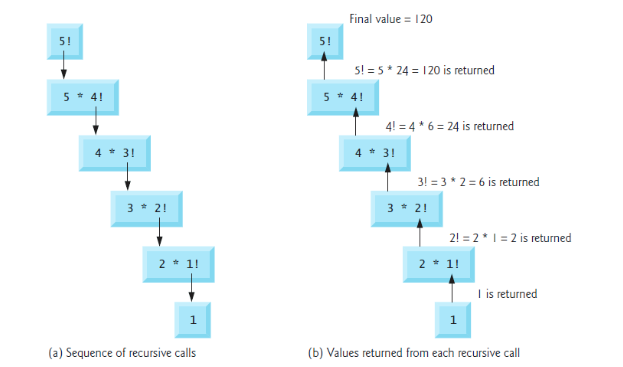

# **TOPIC 06 - RECURSION**

## **1. Introduction**

In previous lab tutorial, we have organized our program into functions which call one another in a disciplined. For some types of problems, it's useful to have functions call themselves, and it's called as recursive function. In this lab tutorial, we'll consider the recursion conceptually first, then examine several programs containing recursive function.

## **2. Recursive Function**

A **recursive function** is a function that calls itself either directly or indirectly through another function. Recursive function knows how to solve only the *simplest case(s)*, or so-called *base-case(s)*. If the function is called with a base case, the function simply returns a result. If the function is called with a more complex problem, the function divides the problem into two conceptual pieces: a piece that the function knows how to do and a piece that does now know how to do. In the second piece, it contains the original problem, but in a simpler or smaller version. Because this new problem looks like the original problem, we cal it as recursive call.

The recursion call can execute in many times, since the function keeps dividing each problem into two pieces. For the recursion call to terminate, each time it calls itself with a simpler version of original problem, and this sequence must converge on the base case. When the function recognizes the base case, it returns a result to the previous copy of the function, and a sequence of returns ensues all the way up the line until the original call of the function eventually returns the final result.

### **2.1 Recursively calculating factorials**

The factorial of a none-negative integer number, denoted by *n*, is definded as follows:

$$n! = n*(n-1)*(n-2)*...*1=n*(n-1)!$$

In the above formula, the second section defines how-to calculate factorial of *n* in an iterative version, thus we can use the `for` statement as follows:

```C
float factorial = 1;
for(int i = 2; i <= n; i++){
    factorial = factorial * i;
}
```

From the `for` statement, we can easily see that each time the statement inside for executes, it takes the last `factorial` result and multiply with the new `i` value, thus we can define the factorial of `n` as the third part in the formula, that is, $5!=5*4*3*2*1=5*4!=120$. The evaluation of $5!$ would proceed as in **below figure**, in the left figure, the recursive call executes until $1!$, and it returns 1 (the *base case*) and terminate the recusion. In the left figure, it shows the values returned from each recursive call to its caller until the final value is calculated and returned.



The below program will illustrates how-to program a recursive function.

```C
#include<stdio.h>

float getFactorial(int);

int main(){
    int n = 5;
    printf("Factorial (%d) = %f", n, getFactorial(n));
    
    return 0;
}

float getFactorial(int n){
    if(n == 0 || n == 1) return 1;
    return n * getFactorial(n - 1);
}
```

### **2.2 Fibonacci serires**

The Fibonacci series begins with 0 and 1 and has the property that each subsequent Fibonacci number is the sum of the previous two Fibonacci numbers. The Fibonacci series may be defined recursively as follows:

```text
fibonacci(0) = 0
fibonacci(1) = 1
fibonacci(n) = fibonacci(n - 1) + fibonacci(n - 2)
```

From the above formula calculates the $n^{th}$ Fibonacci number recursively using function `fibonacci`. Notice that Fibonacce numbers tend to become large quickly, thus we choose data type `float` for the parameter type and the return type also.

```C
#include<stdio.h>

float fibonacci(float);

int main(){
    float n = 10;
    printf("Fibonacci (%f) = %f", n, fibonacci(n));
    
    return 0;
}

float fibonacci(float n){
    if(n == 0) return 0;
    if(n == 1) return 1;
    return fibonacci(n - 1) + fibonacci(n - 2);
}
```

Each time `fibonacci` is invoked, it immediately tests for the base case - *n* is equal to 0 or 1. If this is true, *n* is returned. Interestingly, if *n* is greater than 1, the recursion step generates two recursive calls, each a slightly simpler problem than the original call to `fibonacci`. The **below figure** shows how function `fibonacci` evaluates when *n* = 3.

.png)

## **3. Recursion vs. Iteration**

We have studied two kind of functions which implemented in either recursive or iteratively. In this section, we compare the two approaches and discuss why you might choose one approach over the other in a particular situation.

- Both interation and recursion are based on a control structure: Interation uses a *repetition structure*; recursion uses a *selection structure*.
- Both interation and recursion involve *repetition*: Interation explicitly uses a *repetition statement*; recursion achieves repetition through *repeated function calls*.
- Interation and recursion each involve a *termination test*. Interation terminates when the *loop-continuation fails*; recursion when a *base case is recognized*.
- Interation with counter-controlled repetition and recursion each *gradually approach termination*. Iteration keep modifying a counter until the counter assumes a value that makes the *loop-continuation condition fail*; recursion keeps producing simpler versions of the original problem until the *base case is reached*.
- Both iteration and recursion can occur *infinitely*: An *infinite loop* occurs with iteration if the loop-continuation test *never* becomes false; *infinite recursion* occurs if the recursion step does not reduce the problem each time in a manner that *converges on the base case*.

Recursion has many negatives. It repeatedly invokes the mechanism, and consequently the overhead, of function calls. This can be expensive in both processor time and memory space. Each recursive call causes another copy of the function (only the functions's variable) to be created; this can consume considerable memory. Iteration normally occurs withing a function, so the overhead of repeated function calls and extra memory assignment is omitted.

## **4. Exercises**

1. Define a recursive function that check whether a number is prime.
2. Define a recursive function to compute factorial of `n`.
3. Define a recursive function to compute $2^{n}$.
4. Define a recursive function to compute $x^{n}$.
5. Define a recursive function to return the number of digits of a positive integer number.
6. Define a recursive function to calculate the following expression:

    1. $$\sum_{i=1}^{n}(2i + 1)$$
    2. $$\sum_{i=1}^{n}\frac{i}{2}$$
    3. $$\sum_{i=1}^{n}i!$$
    4. $$\sum_{i=1}^{n}\sqrt{i}$$
    5. $$\prod_{i=1}^{n}i!$$
